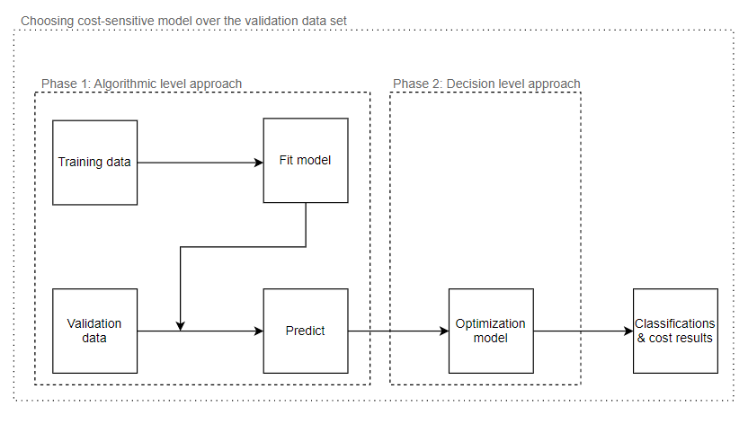

#  A Hybrid Cost-Sensitive Machine Learning and Optimization Models

### We propose a comprehensive analytic framework for scenarios that, in addition to including multi-class classification problems with misclassification costs, also have constraints on the number of classified samples of classes due to resource limitations.
#### This algorithm is suitable for classic ML algorithms such as decision tree, random forest and adaboost.

## Data
We applied our framework on a public available data set about churn rate.
The dataset made available at: [churn-risk-rate](https://www.kaggle.com/datasets/imsparsh/churn-risk-rate-hackerearth-ml).
Change files' names: train to train_datat and test to test_data.

